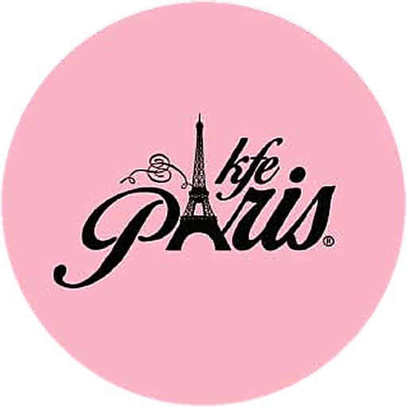
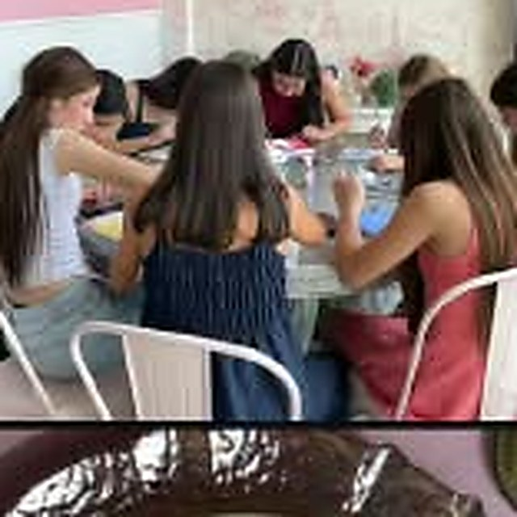
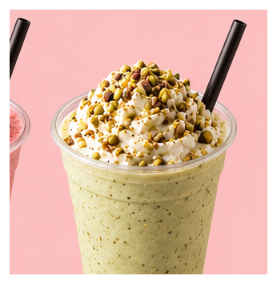

# ☕ Kfé Paris — Cafetería & Restaurant · Menú digital y reservas por WhatsApp

> **Demo comercial** para **Kfé Paris Café · Restaurant — CC Ciudadela Plaza, Maracaibo**.
> Este repositorio es una **vitrina**: muestra el resultado y la galería; el **código fuente es privado**.

## 🚀 Probar la demo

**👉 [kfe-paris-demo.vercel.app](https://kfe-paris-demo.vercel.app)** — funciona en móvil y escritorio, sin instalación.

---

## 📸 Identidad y propuesta

| Logo y marca | Ambiente |
|---|---|
|  |  |

| Especialidad de la casa | Favorito del menú |
|---|---|
|  |  |

> La demo en vivo muestra la experiencia completa: hero parisino, catálogo con precios en USD, carrito y salida a WhatsApp.

---

## ✨ Qué incluye

- **Hero con la estética del local** (rosa pastel, tipografía elegante, identidad propia — no una plantilla genérica).
- **Catálogo interactivo** con categorías, fotos reales y precios en USD.
- **Carrito con modalidades** *Mesa / Para llevar / A domicilio* y **reservación para domingo** (el local solo acepta reservaciones los domingos: la demo responde a esa operación real).
- **Pedido/reserva a WhatsApp estructurado**: desglose, total, mesa o dirección, listos para confirmar.
- **Promociones destacadas** (descuento del día) para mover producto.
- **Carga instantánea** (HTML/CSS/JS puro) y **SEO local** con horario, dirección y contacto.

## 🔄 Cómo funciona para el cliente

1. Entra desde el enlace o un **código QR** en mesa.
2. Elige cafés, postres o salados en **3 clics**.
3. Toca *“Enviar pedido por WhatsApp”* (o reservar para domingo): el negocio recibe la orden **calculada** en su chat.

## 🛠️ Tecnologías

`HTML5` · `CSS3` a medida · `JavaScript` vanilla · **Vercel** (CDN global + SSL)

> Sin bases de datos ni servidores: solución estática de bajo costo y cero mantenimiento. El menú se parametriza (logo, colores, productos, teléfono) para adaptarlo a cualquier negocio en menos de una hora.

## 📌 Sobre este repositorio

- ✅ Repositorio **público de vitrina** (imágenes + enlace a la demo en vivo).
- 🔒 El **código fuente no se publica**: la plantilla es propiedad de su autor.
- ⚠️ Prototipo creado como propuesta comercial de demostración; **no está afiliado ni respaldado** por el negocio mostrado.
